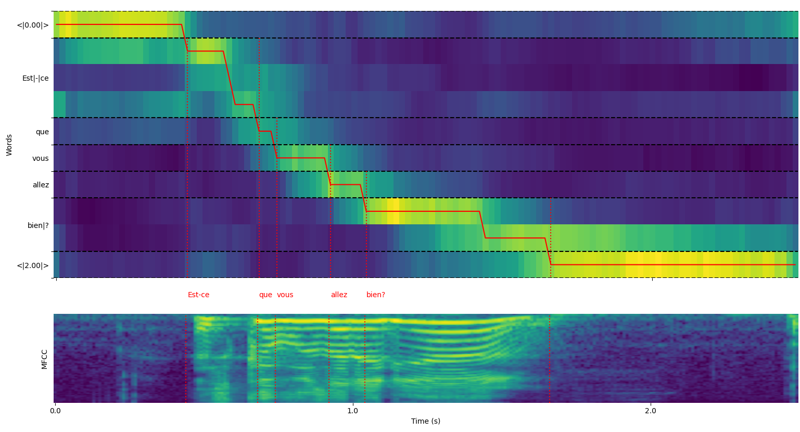
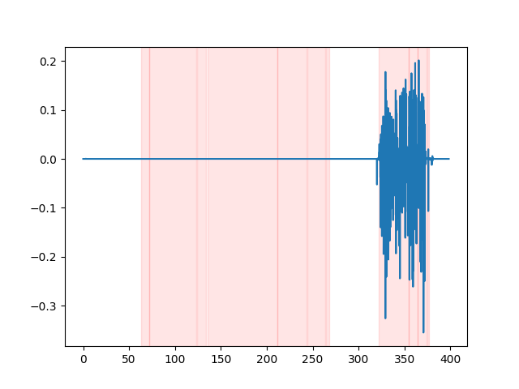
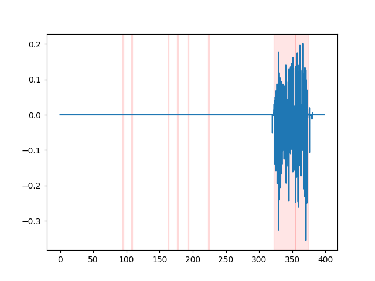

# whisper-timestamped

Multilingual Automatic Speech Recognition with word-level timestamps and confidence.

* [Description](#description)
   * [Notes on other approaches](#notes-on-other-approaches)
* [Installation](#installation)
   * [First installation](#first-installation)
      * [Additional packages that might be needed](#additional-packages-that-might-be-needed)
      * [Docker](#docker)
   * [Light installation for CPU](#light-installation-for-cpu)
   * [Upgrade to the latest version](#upgrade-to-the-latest-version)
* [Usage](#usage)
   * [Python](#python)
   * [Command line](#command-line)
   * [Utility Functions](#utility-functions)
   * [Plot of word alignment](#plot-of-word-alignment)
   * [Example output](#example-output)
* [API Reference](#api-reference)
   * [Main Transcription Function](#main-transcription-function)
   * [Utility Functions](#utility-functions-1)
   * [File Writing Functions](#file-writing-functions)
* [Options that may improve results](#options-that-may-improve-results)
   * [Accurate Whisper transcription](#accurate-whisper-transcription)
   * [Running Voice Activity Detection (VAD) before sending to Whisper](#running-voice-activity-detection-vad-before-sending-to-whisper)
   * [Detecting disfluencies](#detecting-disfluencies)
* [Acknowledgments/Support](#acknowledgments-support)
* [Citations](#citations)

## Description

[Whisper](https://openai.com/blog/whisper/) is a set of multi-lingual, robust speech recognition models trained by OpenAI that achieve state-of-the-art results in many languages. Whisper models were trained to predict approximate timestamps on speech segments (most of the time with 1-second accuracy), but they cannot originally predict word timestamps. This repository proposes an implementation to **predict word timestamps and provide a more accurate estimation of speech segments when transcribing with Whisper models**.
Besides, a confidence score is assigned to each word and each segment.

The approach is based on Dynamic Time Warping (DTW) applied to cross-attention weights, as demonstrated by [this notebook by Jong Wook Kim](https://github.com/openai/whisper/blob/f82bc59f5ea234d4b97fb2860842ed38519f7e65/notebooks/Multilingual_ASR.ipynb). There are some additions to this notebook:
* The start/end estimation is more accurate.
* Confidence scores are assigned to each word.
* **If possible (without beam search...)**, no additional inference steps are required to predict word timestamps (word alignment is done on the fly after each speech segment is decoded).
* Special care has been taken regarding memory usage: `whisper-timestamped` is able to process long files with little additional memory compared to the regular use of the Whisper model.

`whisper-timestamped` is an extension of the [`openai-whisper`](https://pypi.org/project/whisper-openai/) Python package and is meant to be compatible with any version of `openai-whisper`.
It provides more efficient/accurate word timestamps, along with those additional features:
* Voice Activity Detection (VAD) can be run before applying Whisper model,
  to avoid hallucinations due to errors in the training data (for instance, predicting "Thanks you for watching!" on pure silence).
  Several VAD methods are available: silero (default), auditok, auditok:v3.1
* When the language is not specified, the language probabilities are provided among the outputs.

**Disclaimer: Please note that this extension is intended for experimental purposes and may significantly impact performance. We are not responsible for any issues or inefficiencies that arise from its use.**

### Notes on other approaches

An alternative relevant approach to recovering word-level timestamps involves using wav2vec models that predict characters, as successfully implemented in [whisperX](https://github.com/m-bain/whisperX). However, these approaches have several drawbacks that are not present in approaches based on cross-attention weights such as `whisper_timestamped`. These drawbacks include:
* The need to find one wav2vec model per language to support, which does not scale well with the multi-lingual capabilities of Whisper.
* The need to handle (at least) one additional neural network (wav2vec model), which consumes memory.
* The need to normalize characters in Whisper transcription to match the character set of the wav2vec model. This involves awkward language-dependent conversions, such as converting numbers to words ("2" -> "two"), symbols to words ("%" -> "percent", "€" -> "euro(s)")...
* The lack of robustness around speech disfluencies (fillers, hesitations, repeated words...) that are usually removed by Whisper.

An alternative approach that does not require an additional model is to look at the probabilities of timestamp tokens estimated by the Whisper model after each (sub)word token is predicted. This was implemented, for instance, in whisper.cpp and stable-ts. However, this approach lacks robustness because Whisper models have not been trained to output meaningful timestamps after each word. Whisper models tend to predict timestamps only after a certain number of words have been predicted (typically at the end of a sentence), and the probability distribution of timestamps outside this condition may be inaccurate. In practice, these methods can produce results that are totally out-of-sync on some periods of time (we observed this especially when there is jingle music). Also, the timestamp precision of Whisper models tends to be rounded to 1 second (as in many video subtitles), which is too inaccurate for words, and reaching better accuracy is tricky.

## Installation

### First installation

Requirements:
* `python3` (version higher or equal to 3.7, at least 3.9 is recommended)
* `ffmpeg` (see instructions for installation on the [whisper repository](https://github.com/openai/whisper))

You can install `whisper-timestamped` either by using pip:
```bash
pip3 install whisper-timestamped
```

or by cloning this repository and running installation:
```bash
git clone https://github.com/linto-ai/whisper-timestamped
cd whisper-timestamped/
python3 setup.py install
```

#### Additional packages that might be needed

If you want to plot alignment between audio timestamps and words (as in [this section](#plot-of-word-alignment)), you also need matplotlib:
```bash
pip3 install matplotlib
```

If you want to use VAD option (Voice Activity Detection before running Whisper model), you also need torchaudio and onnxruntime:
```bash
pip3 install onnxruntime torchaudio
```

If you want to use finetuned Whisper models from the Hugging Face Hub, you also need transformers:
```bash
pip3 install transformers
```

#### Docker

A docker image of about 9GB can be built using:
```bash
git clone https://github.com/linto-ai/whisper-timestamped
cd whisper-timestamped/
docker build -t whisper_timestamped:latest .
```

### Light installation for CPU

If you don't have a GPU (or don't want to use it), then you don't need to install the CUDA dependencies. You should then just install a light version of torch **before** installing whisper-timestamped, for instance as follows:
```bash
pip3 install \
     torch==1.13.1+cpu \
     torchaudio==0.13.1+cpu \
     -f https://download.pytorch.org/whl/torch_stable.html
```

A specific docker image of about 3.5GB can also be built using:
```bash
git clone https://github.com/linto-ai/whisper-timestamped
cd whisper-timestamped/
docker build -t whisper_timestamped_cpu:latest -f Dockerfile.cpu .
```

### Upgrade to the latest version

When using pip, the library can be updated to the latest version using:
```
pip3 install --upgrade --no-deps --force-reinstall git+https://github.com/linto-ai/whisper-timestamped
```

A specific version of `openai-whisper` can be used by running, for example:
```bash
pip3 install openai-whisper==20230124
```

## Usage

### Python

In Python, you can use the function `whisper_timestamped.transcribe()`, which is similar to the function `whisper.transcribe()`:
```python
import whisper_timestamped
help(whisper_timestamped.transcribe)
```
The main difference with `whisper.transcribe()` is that the output will include a key `"words"` for all segments, with the word start and end position. Note that the word will include punctuation. See the example [below](#example-output).

Besides, the default decoding options are different to favour efficient decoding (greedy decoding instead of beam search, and no temperature sampling fallback). To have same default as in `whisper`, use ```beam_size=5, best_of=5, temperature=(0.0, 0.2, 0.4, 0.6, 0.8, 1.0)```.

There are also additional options related to word alignement.

In general, if you import `whisper_timestamped` instead of `whisper` in your Python script and use `transcribe(model, ...)` instead of `model.transcribe(...)`, it should do the job:
```python
import whisper_timestamped as whisper

audio = whisper.load_audio("AUDIO.wav")

model = whisper.load_model("tiny", device="cpu")

result = whisper.transcribe(model, audio, language="fr")

import json
print(json.dumps(result, indent = 2, ensure_ascii = False))
```

Note that you can use a finetuned Whisper model from HuggingFace or a local folder by using the `load_model` method of `whisper_timestamped`. For instance, if you want to use [whisper-large-v2-nob](https://huggingface.co/NbAiLab/whisper-large-v2-nob), you can simply do the following:
```python
import whisper_timestamped as whisper

model = whisper.load_model("NbAiLab/whisper-large-v2-nob", device="cpu")

# ...
```

### Command line

You can also use `whisper_timestamped` on the command line, similarly to `whisper`. See help with:
```bash
whisper_timestamped --help
```

The main differences with `whisper` CLI are:
* Output files:
  * The output JSON contains word timestamps and confidence scores. See example [below](#example-output).
  * There is an additional CSV output format.
  * For SRT, VTT, TSV formats, there will be additional files saved with word timestamps.
* Some default options are different:
  * By default, no output folder is set: Use `--output_dir .` for Whisper default.
  * By default, there is no verbose: Use `--verbose True` for Whisper default.
  * By default, beam search decoding and temperature sampling fallback are disabled, to favour an efficient decoding.
    To set the same as Whisper default, you can use `--accurate` (which is an alias for ```--beam_size 5 --temperature_increment_on_fallback 0.2 --best_of 5```).
* There are some additional specific options:
  <!-- * `--efficient` to use a faster greedy decoding (without beam search neither several sampling at each step),
  which enables a special path where word timestamps are computed on the fly (no need to run inference twice).
  Note that transcription results might be significantly worse on challenging audios with this option. -->
  * `--compute_confidence` to enable/disable the computation of confidence scores for each word.
  * `--punctuations_with_words` to decide whether punctuation marks should be included or not with preceding words.

An example command to process several files using the `tiny` model and output the results in the current folder, as would be done by default with whisper, is as follows:
```
whisper_timestamped audio1.flac audio2.mp3 audio3.wav --model tiny --output_dir .
```

Note that you can use a fine-tuned Whisper model from HuggingFace or a local folder. For instance, if you want to use the [whisper-large-v2-nob](https://huggingface.co/NbAiLab/whisper-large-v2-nob) model, you can simply do the following:
```
whisper_timestamped --model NbAiLab/whisper-large-v2-nob <...>
```

### Utility Functions

In addition to the main `transcribe` function, whisper-timestamped provides some utility functions:

#### `remove_non_speech`

Remove non-speech segments from audio using Voice Activity Detection (VAD).

```python
from whisper_timestamped import remove_non_speech

audio_speech, segments, convert_timestamps = remove_non_speech(audio, vad="silero")
```

#### `load_model`

Load a Whisper model from a given name or path, including support for fine-tuned models from HuggingFace.

```python
from whisper_timestamped import load_model

model = load_model("NbAiLab/whisper-large-v2-nob", device="cpu")
```

### Plot of word alignment

Note that you can use the `plot_word_alignment` option of the `whisper_timestamped.transcribe()` Python function or the `--plot` option of the `whisper_timestamped` CLI to see the word alignment for each segment.



* The upper plot represents the transformation of cross-attention weights used for alignment with Dynamic Time Warping. The abscissa represents time, and the ordinate represents the predicted tokens, with special timestamp tokens at the beginning and end, and (sub)words and punctuation in the middle.
* The lower plot is an MFCC representation of the input signal (features used by Whisper, based on Mel-frequency cepstrum).
* The vertical dotted red lines show where the word boundaries are found (with punctuation marks "glued" to the previous word).

### Example output

The output of `whisper_timestamped.transcribe()` function is a python dictionary,
which can be viewed in JSON format using the CLI.

The JSON schema can be seen in [tests/json_schema.json](tests/json_schema.json).

Here is an example output:
```bash
whisper_timestamped AUDIO_FILE.wav --model tiny --language fr
```
```json
{
  "text": " Bonjour! Est-ce que vous allez bien?",
  "segments": [
    {
      "id": 0,
      "seek": 0,
      "start": 0.5,
      "end": 1.2,
      "text": " Bonjour!",
      "tokens": [ 25431, 2298 ],
      "temperature": 0.0,
      "avg_logprob": -0.6674491882324218,
      "compression_ratio": 0.8181818181818182,
      "no_speech_prob": 0.10241222381591797,
      "confidence": 0.51,
      "words": [
        {
          "text": "Bonjour!",
          "start": 0.5,
          "end": 1.2,
          "confidence": 0.51
        }
      ]
    },
    {
      "id": 1,
      "seek": 200,
      "start": 2.02,
      "end": 4.48,
      "text": " Est-ce que vous allez bien?",
      "tokens": [ 50364, 4410, 12, 384, 631, 2630, 18146, 3610, 2506, 50464 ],
      "temperature": 0.0,
      "avg_logprob": -0.43492694334550336,
      "compression_ratio": 0.7714285714285715,
      "no_speech_prob": 0.06502953916788101,
      "confidence": 0.595,
      "words": [
        {
          "text": "Est-ce",
          "start": 2.02,
          "end": 3.78,
          "confidence": 0.441
        },
        {
          "text": "que",
          "start": 3.78,
          "end": 3.84,
          "confidence": 0.948
        },
        {
          "text": "vous",
          "start": 3.84,
          "end": 4.0,
          "confidence": 0.935
        },
        {
          "text": "allez",
          "start": 4.0,
          "end": 4.14,
          "confidence": 0.347
        },
        {
          "text": "bien?",
          "start": 4.14,
          "end": 4.48,
          "confidence": 0.998
        }
      ]
    }
  ],
  "language": "fr"
}
```
If the language is not specified (e.g. without option `--language fr` in the CLI) you will find an additional key with the language probabilities:
```json
{
  ...
  "language": "fr",
  "language_probs": {
    "en": 0.027954353019595146,
    "zh": 0.02743500843644142,
    ...
    "fr": 0.9196318984031677,
    ...
    "su": 3.0119704064190955e-08,
    "yue": 2.2565967810805887e-05
  }
}
```

## API Reference

### Main Transcription Function

#### `transcribe_timestamped(model, audio, **kwargs)`

Transcribe audio using a Whisper model and compute word-level timestamps.

##### Parameters:

- `model`: Whisper model instance
  The Whisper model to use for transcription.

- `audio`: Union[str, np.ndarray, torch.Tensor]
  The path to the audio file to transcribe, or the audio waveform as a NumPy array or PyTorch tensor.

- `language`: str, optional (default: None)
  The language of the audio. If None, language detection will be performed.

- `task`: str, default "transcribe"
  The task to perform: either "transcribe" for speech recognition or "translate" for translation to English.

- `vad`: Union[bool, str, List[Tuple[float, float]]], optional (default: False)
  Whether to use Voice Activity Detection (VAD) to remove non-speech segments. Can be:
  - True/False: Enable/disable VAD (uses Silero VAD by default)
  - "silero": Use Silero VAD
  - "auditok": Use Auditok VAD
  - List of (start, end) timestamps: Explicitly specify speech segments

- `detect_disfluencies`: bool, default False
  Whether to detect and mark disfluencies (hesitations, filler words, etc.) in the transcription.

- `trust_whisper_timestamps`: bool, default True
  Whether to rely on Whisper's timestamps for initial segment positions.

- `compute_word_confidence`: bool, default True
  Whether to compute confidence scores for words.

- `include_punctuation_in_confidence`: bool, default False
  Whether to include punctuation probability when computing word confidence.

- `refine_whisper_precision`: float, default 0.5
  How much to refine Whisper segment positions, in seconds. Must be a multiple of 0.02.

- `min_word_duration`: float, default 0.02
  Minimum duration of a word, in seconds.

- `plot_word_alignment`: bool or str, default False
  Whether to plot the word alignment for each segment. If a string, save the plot to the given file.

- `word_alignement_most_top_layers`: int, optional (default: None)
  Number of top layers to use for word alignment. If None, use all layers.

- `remove_empty_words`: bool, default False
  Whether to remove words with no duration occurring at the end of segments.

- `naive_approach`: bool, default False
  Force the naive approach of decoding twice (once for transcription, once for alignment).

- `use_backend_timestamps`: bool, default False
  Whether to use word timestamps provided by the backend (openai-whisper or transformers), instead of the ones computed by more complex heuristics of whisper-timestamped.

- `temperature`: Union[float, List[float]], default 0.0
  Temperature for sampling. Can be a single value or a list for fallback temperatures.

- `compression_ratio_threshold`: float, default 2.4
  If the gzip compression ratio is above this value, treat the decoding as failed.

- `logprob_threshold`: float, default -1.0
  If the average log probability is below this value, treat the decoding as failed.

- `no_speech_threshold`: float, default 0.6
  Probability threshold for <|nospeech|> tokens.

- `condition_on_previous_text`: bool, default True
  Whether to provide the previous output as a prompt for the next window.

- `initial_prompt`: str, optional (default: None)
  Optional text to provide as a prompt for the first window.

- `suppress_tokens`: str, default "-1"
  Comma-separated list of token ids to suppress during sampling.

- `fp16`: bool, optional (default: None)
  Whether to perform inference in fp16 precision.

- `verbose`: bool or None, default False
  Whether to display the text being decoded to the console. If True, displays all details. If False, displays minimal details. If None, does not display anything.

##### Returns:

A dictionary containing:
- `text`: str - The full transcription text
- `segments`: List[dict] - List of segment dictionaries, each containing:
  - `id`: int - Segment ID
  - `seek`: int - Start position in the audio file (in samples)
  - `start`: float - Start time of the segment (in seconds)
  - `end`: float - End time of the segment (in seconds)
  - `text`: str - Transcribed text for the segment
  - `tokens`: List[int] - Token IDs for the segment
  - `temperature`: float - Temperature used for this segment
  - `avg_logprob`: float - Average log probability of the segment
  - `compression_ratio`: float - Compression ratio of the segment
  - `no_speech_prob`: float - Probability of no speech in the segment
  - `confidence`: float - Confidence score for the segment
  - `words`: List[dict] - List of word dictionaries, each containing:
    - `start`: float - Start time of the word (in seconds)
    - `end`: float - End time of the word (in seconds)
    - `text`: str - The word text
    - `confidence`: float - Confidence score for the word (if computed)
- `language`: str - Detected or specified language
- `language_probs`: dict - Language detection probabilities (if applicable)

##### Exceptions:

- `RuntimeError`: If the VAD method is not properly installed or configured.
- `ValueError`: If the `refine_whisper_precision` is not a positive multiple of 0.02.
- `AssertionError`: If the audio duration is shorter than expected or if there are inconsistencies in the number of segments.

##### Notes:

- The function uses the Whisper model to transcribe the audio and then performs additional processing to generate word-level timestamps and confidence scores.
- The VAD feature can significantly improve transcription accuracy by removing non-speech segments, but it requires additional dependencies (e.g., torchaudio and onnxruntime for Silero VAD).
- The `naive_approach` parameter can be useful for debugging or when dealing with specific audio characteristics, but it may be slower than the default approach.
- When `use_efficient_by_default` is True, some parameters like `best_of`, `beam_size`, and `temperature_increment_on_fallback` are set to None by default for more efficient processing.
- The function supports both OpenAI Whisper and Transformers backends, which can be specified when loading the model.

### Utility Functions

#### `remove_non_speech(audio, **kwargs)`

Remove non-speech segments from audio using Voice Activity Detection (VAD).

##### Parameters:

- `audio`: torch.Tensor
  Audio data as a PyTorch tensor.

- `use_sample`: bool, default False
  If True, return start and end times in samples instead of seconds.

- `min_speech_duration`: float, default 0.1
  Minimum duration of a speech segment in seconds.

- `min_silence_duration`: float, default 1
  Minimum duration of a silence segment in seconds.

- `dilatation`: float, default 0.5
  How much to enlarge each speech segment detected by VAD, in seconds.

- `sample_rate`: int, default 16000
  Sample rate of the audio.

- `method`: str or List[Tuple[float, float]], default "silero"
  VAD method to use. Can be "silero", "auditok", or a list of timestamps.

- `avoid_empty_speech`: bool, default False
  If True, avoid returning an empty speech segment.

- `plot`: Union[bool, str], default False
  If True, plot the VAD results. If a string, save the plot to the given file.

##### Returns:

A tuple containing:
1. torch.Tensor: Audio with non-speech segments removed
2. List[Tuple[float, float]]: List of (start, end) timestamps for speech segments
3. Callable: Function to convert timestamps from the new audio to the original audio

##### Exceptions:

- `ImportError`: If the required VAD library (e.g., auditok) is not installed.
- `ValueError`: If an invalid VAD method is specified.

##### Notes:

- This function is particularly useful for improving transcription accuracy by removing silence and non-speech segments from the audio before processing.
- The choice of VAD method can affect the accuracy and speed of the non-speech removal process.

#### `load_model(name, device=None, backend="openai-whisper", download_root=None, in_memory=False)`

Load a Whisper model from a given name or path.

##### Parameters:

- `name`: str
  Name of the model or path to the model. Can be:
  - OpenAI Whisper identifier: "large-v3", "medium.en", etc.
  - HuggingFace identifier: "openai/whisper-large-v3", "distil-whisper/distil-large-v2", etc.
  - File name: "path/to/model.pt", "path/to/model.ckpt", "path/to/model.bin"
  - Folder name: "path/to/folder"

- `device`: Union[str, torch.device], optional (default: None)
  Device to use. If None, use CUDA if available, otherwise CPU.

- `backend`: str, default "openai-whisper"
  Backend to use. Either "transformers" or "openai-whisper".

- `download_root`: str, optional (default: None)
  Root folder to download the model to. If None, use the default download root.

- `in_memory`: bool, default False
  Whether to preload the model weights into host memory.

##### Returns:

The loaded Whisper model.

##### Exceptions:

- `ValueError`: If an invalid backend is specified.
- `ImportError`: If the transformers library is not installed when using the "transformers" backend.
- `RuntimeError`: If the model cannot be found or downloaded from the specified source.
- `OSError`: If there are issues reading the model file or accessing the specified path.

##### Notes:

- When using a local model file, ensure that the file format is compatible with the selected backend.
- For HuggingFace models, an internet connection may be required to download the model if it's not already cached locally.
- The function supports loading both OpenAI Whisper and Transformers models, providing flexibility in model selection.

#### `get_alignment_heads(model, max_top_layer=3)`

Get the alignment heads for the given model.

##### Parameters:

- `model`: Whisper model instance
  The Whisper model for which to retrieve alignment heads.

- `max_top_layer`: int, default 3
  Maximum number of top layers to consider for alignment heads.

##### Returns:

A sparse tensor representing the alignment heads.

##### Notes:

- This function is used internally to optimize the word alignment process.
- The alignment heads are model-specific and are used to improve the accuracy of word-level timestamps.

### File Writing Functions

The following functions are available for writing transcripts to various file formats:

#### `write_csv(transcript, file, sep=",", text_first=True, format_timestamps=None, header=False)`

Write transcript data to a CSV file.

##### Parameters:

- `transcript`: List[dict]
  List of transcript segment dictionaries.

- `file`: file-like object
  File to write the CSV data to.

- `sep`: str, default ","
  Separator to use in the CSV file.

- `text_first`: bool, default True
  If True, write text column before start/end times.

- `format_timestamps`: Callable, optional (default: None)
  Function to format timestamp values.

- `header`: Union[bool, List[str]], default False
  If True, write default header. If a list, use as custom header.

##### Exceptions:

- `IOError`: If there are issues writing to the specified file.
- `ValueError`: If the transcript data is not in the expected format.

##### Notes:

- This function is useful for exporting transcription results in a tabular format for further analysis or processing.
- The `format_timestamps` parameter allows for custom formatting of timestamp values, which can be helpful for specific use cases or data analysis requirements.

#### `write_srt(transcript, file)`

Write transcript data to an SRT (SubRip Subtitle) file.

##### Parameters:

- `transcript`: List[dict]
  List of transcript segment dictionaries.

- `file`: file-like object
  File to write the SRT data to.

##### Exceptions:

- `IOError`: If there are issues writing to the specified file.
- `ValueError`: If the transcript data is not in the expected format.

##### Notes:

- SRT is a widely supported subtitle format, making this function useful for creating subtitles for videos based on the transcription.

#### `write_vtt(transcript, file)`

Write transcript data to a VTT (WebVTT) file.

##### Parameters:

- `transcript`: List[dict]
  List of transcript segment dictionaries.

- `file`: file-like object
  File to write the VTT data to.

##### Exceptions:

- `IOError`: If there are issues writing to the specified file.
- `ValueError`: If the transcript data is not in the expected format.

##### Notes:

- WebVTT is a W3C standard for displaying timed text in connection with HTML5, making this function useful for web-based applications.

#### `write_tsv(transcript, file)`

Write transcript data to a TSV (Tab-Separated Values) file.

##### Parameters:

- `transcript`: List[dict]
  List of transcript segment dictionaries.

- `file`: file-like object
  File to write the TSV data to.

##### Exceptions:

- `IOError`: If there are issues writing to the specified file.
- `ValueError`: If the transcript data is not in the expected format.

##### Notes:

- TSV files are useful for importing transcription data into spreadsheet applications or other data analysis tools.

## Options that may improve results

Here are some options that are not enabled by default but might improve results.

### Accurate Whisper transcription

As mentioned earlier, some decoding options are disabled by default to offer better efficiency. However, this can impact the quality of the transcription. To run with the options that have the best chance of providing a good transcription, use the following options.
* In Python:
```python
results = whisper_timestamped.transcribe(model, audio, beam_size=5, best_of=5, temperature=(0.0, 0.2, 0.4, 0.6, 0.8, 1.0), ...)
```
* On the command line:
```bash
whisper_timestamped --accurate ...
```

### Running Voice Activity Detection (VAD) before sending to Whisper

Whisper models can "hallucinate" text when given a segment without speech. This can be avoided by running VAD and gluing speech segments together before transcribing with the Whisper model. This is possible with `whisper-timestamped`.
* In Python:
```python
results = whisper_timestamped.transcribe(model, audio, vad=True, ...)
```
* On the command line:
```bash
whisper_timestamped --vad True ...
```

By default, the VAD method used is [silero](https://github.com/snakers4/silero-vad).
But other methods are available, such as earlier versions of silero, or [auditok](https://github.com/amsehili/auditok).
Those methods were introduced because latest versions of silero VAD can have a lot of false alarms on some audios (speech detected on silence).
* In Python:
```python
results = whisper_timestamped.transcribe(model, audio, vad="silero:v3.1", ...)
results = whisper_timestamped.transcribe(model, audio, vad="auditok", ...)
```
* On the command line:
```bash
whisper_timestamped --vad silero:v3.1 ...
whisper_timestamped --vad auditok ...
```

In order to watch the VAD results, you can use the `--plot` option of the `whisper_timestamped` CLI,
or the `plot_word_alignment` option of the `whisper_timestamped.transcribe()` Python function.
It will show the VAD results on the input audio signal as following (x-axis is time in seconds):
| **vad="silero:v4.0"** | **vad="silero:v3.1"** | **vad="auditok"** |
| :---: | :---: | :---: |
|  |   |  |

### Detecting disfluencies

Whisper models tend to remove speech disfluencies (filler words, hesitations, repetitions, etc.). Without precautions, the disfluencies that are not transcribed will affect the timestamp of the following word: the timestamp of the beginning of the word will actually be the timestamp of the beginning of the disfluencies. `whisper-timestamped` can have some heuristics to avoid this.
* In Python:
```python
results = whisper_timestamped.transcribe(model, audio, detect_disfluencies=True, ...)
```
* On the command line:
```bash
whisper_timestamped --detect_disfluencies True ...
```
**Important:** Note that when using these options, possible disfluencies will appear in the transcription as a special "`[*]`" word.

## Acknowledgments/Support

whisper-timestamped was coded mainly by [Jérôme Louradour](https://www.linkedin.com/in/jeronymous).
It is based on the following libraries:
* [whisper](https://github.com/openai/whisper): Whisper speech recognition (License MIT).
* [dtw-python](https://pypi.org/project/dtw-python): Dynamic Time Warping (License GPL v3).

Please consider supporting the development of this library by buying me a coffee:

<a href="https://buymeacoffee.com/jeronymous" target="_blank"></a>

## Citations
If you use this in your research, please cite the repo:

```bibtex
@misc{lintoai2023whispertimestamped,
  title={whisper-timestamped},
  author={Louradour, J{\'e}r{\^o}me},
  journal={GitHub repository},
  year={2023},
  publisher={GitHub},
  howpublished = {\url{https://github.com/linto-ai/whisper-timestamped}}
}
```

as well as the OpenAI Whisper paper:

```bibtex
@article{radford2022robust,
  title={Robust speech recognition via large-scale weak supervision},
  author={Radford, Alec and Kim, Jong Wook and Xu, Tao and Brockman, Greg and McLeavey, Christine and Sutskever, Ilya},
  journal={arXiv preprint arXiv:2212.04356},
  year={2022}
}
```

and this paper for Dynamic-Time-Warping:

```bibtex
@article{JSSv031i07,
  title={Computing and Visualizing Dynamic Time Warping Alignments in R: The dtw Package},
  author={Giorgino, Toni},
  journal={Journal of Statistical Software},
  year={2009},
  volume={31},
  number={7},
  doi={10.18637/jss.v031.i07}
}
```
